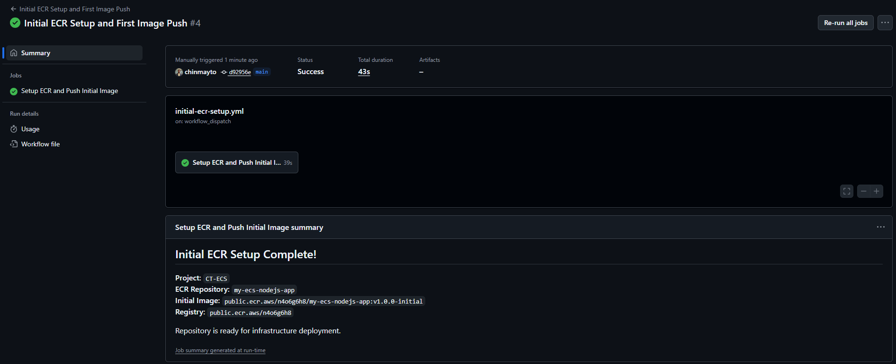

# Deploying Applications to Amazon ECS Using GitHub Actions CI/CD

In the earlier module, we saw how to create an Amazon ECS cluster with a task definition using AWS Community Terraform modules. Now, let’s take the next step—automating application deployment using GitHub Actions CI/CD.

By the end of this blog, you’ll understand how to set up a complete CI/CD pipeline for deploying new versions of your application to ECS, all triggered by source code changes in your repository.

## What We’ll Cover

I’ve created GitHub workflows that handle the following:

1. `initial-ecr-setup.yml` – Create an Amazon ECR public repository, build the Docker image, and push it to ECR.
2. `deploy-infrastructure.yml` – Build the ECS infrastructure (cluster, services, task definitions, ALB) using Terraform.
3. `build-and-deploy.yml` – Deploy an updated version of the app whenever source code changes are pushed.
4. `deploy-infrastructure.yml` – Destroy ECS infrastructure using Terraform.

In this blog, we’ll mainly focus on the CI/CD workflow for application version upgrades.

## CI/CD Pipeline for ECS Deployment

When a new version of your application is committed to the repository, the following GitHub Actions workflow ensures it is automatically built and deployed to ECS.

### Secrets in GitHub Actions

For the above workflows, you’ll need to store sensitive information as GitHub Secrets. Navigate to your repository → Settings → Secrets and variables → Actions and add:
- `AWS_ACCESS_KEY_ID` – IAM user or role access key.
- `AWS_SECRET_ACCESS_KEY` – Corresponding secret key.

This ensures that no credentials are exposed in your workflow files.

The DevOps IAM user that will create the ECS infrastructure and run CICD pipelines will need following accesses. It will also need access to terraform state bucket and dynamodb table used for terraform state locking. Following Principle of least privilege is the need of the day!

```json
{
	"Version": "2012-10-17",
	"Statement": [
		{
			"Effect": "Allow",
			"Action": [
				"ecr-public:*",
				"ecr:*",
				"ecs:*",
				"ec2:*",
				"elasticloadbalancing:*",
				"logs:*",
				"iam:*",
				"application-autoscaling:*",
				"sts:GetServiceBearerToken",
				"sts:GetCallerIdentity"
			],
			"Resource": "*"
		}
	]
}
```

## Initial Setup

To create the public ECR repository and push initial verison of the application to it use `initial-ecr-setup.yml` workflow and then use `deploy-infrastructure.yml` workflow to create ECS infrastructure with baseic version of the application.

## Step 1: Build and Push Docker Image

The workflow first builds a new Docker image from your application source code and tags it with the commit SHA or a version tag. The image is then pushed to the Amazon ECR public repository.
This ensures that ECS always uses the latest available image for deployment.

```yml
name: Build and Deploy Application

on:
  push:
    paths:
      - 'app/**'
    branches:
      - main
      - develop
  pull_request:
    paths:
      - 'app/**'
    branches:
      - main

jobs:
  build-and-push:
    name: Build and Push to ECR
    runs-on: ubuntu-latest
    outputs:
      image-tag: ${{ steps.build-image.outputs.image-tag }}
      image-uri: ${{ steps.build-image.outputs.image-uri }}
    
    steps:
    - name: Checkout code
      uses: actions/checkout@v4

    - name: Configure AWS credentials
      uses: aws-actions/configure-aws-credentials@v4
      with:
        aws-access-key-id: ${{ secrets.AWS_ACCESS_KEY_ID }}
        aws-secret-access-key: ${{ secrets.AWS_SECRET_ACCESS_KEY }}
        aws-region: ${{ env.AWS_REGION }}

    - name: Login to Amazon ECR Public
      id: login-ecr-public
      uses: aws-actions/amazon-ecr-login@v2
      with:
        registry-type: public
        mask-password: 'true'

    - name: Build and push Docker image
      id: build-image
      working-directory: ./app
      run: |
        # Generate image tag using git commit SHA and timestamp
        IMAGE_TAG="${GITHUB_SHA:0:8}-$(date +%s)"
        IMAGE_URI="$ECR_REGISTRY/$ECR_REPOSITORY:$IMAGE_TAG"
        
        echo "Building image: $IMAGE_URI"
        
        # Build the Docker image
        docker build -t $IMAGE_URI .
        
        # Push the image to ECR
        docker push $IMAGE_URI
        
        # Also tag and push as latest
        docker tag $IMAGE_URI $ECR_REGISTRY/$ECR_REPOSITORY:latest
        docker push $ECR_REGISTRY/$ECR_REPOSITORY:latest
        
```

## Step 2: Update ECS Task Definition

ECS services run based on task definitions. To deploy a new version, we first fetch the current task definition JSON using AWS CLI. The workflow updates the container image inside the task definition JSON with the newly built image from Step 1.

```yml
    - name: Download current task definition
      run: |
        aws ecs describe-task-definition \
          --task-definition $TASK_DEFINITION \
          --query taskDefinition > task-definition.json

    - name: Update task definition with new image
      id: task-def
      uses: aws-actions/amazon-ecs-render-task-definition@v1
      with:
        task-definition: task-definition.json
        container-name: ${{ env.CONTAINER_NAME }}
        image: ${{ needs.build-and-push.outputs.image-uri }}
```

## Step 3: Deploy to ECS Service

The new task definition is deployed to ECS using aws-actions/amazon-ecs-deploy-task-definition.

```yml
    - name: Deploy to Amazon ECS service
      uses: aws-actions/amazon-ecs-deploy-task-definition@v2
      with:
        task-definition: ${{ steps.task-def.outputs.task-definition }}
        service: ${{ env.ECS_SERVICE }}
        cluster: ${{ env.ECS_CLUSTER }}
        wait-for-service-stability: true
```

## Accessing the Application

Once the workflow finishes, navigate to the Application Load Balancer (ALB) DNS name associated with your ECS service. You should see the new version of the application running seamlessly.

Initial ECR setup and push image:




Build ECS infrastructure:


## Cleanup

When you’re done testing, you can destroy the ECS infrastructure using the Terraform cleanup workflow in `destroy-infrastructure.yml`

## Conclusion

We successfully set up a CI/CD pipeline using GitHub Actions to deploy applications to Amazon ECS. With this automation in place:

Developers just push code, and deployment happens automatically.
ECS services always stay up-to-date with the latest version of your app.
Infrastructure and deployments are consistent, repeatable, and easy to clean up.

This approach enables faster iteration cycles and ensures your applications remain production-ready.

## References
- [My GitHub Repo](https://github.com/chinmayto/terraform-aws-ecs-cicd)
- [GitHub Actions for ECS](https://docs.github.com/en/actions/how-tos/deploy/deploy-to-third-party-platforms/amazon-elastic-container-service)
